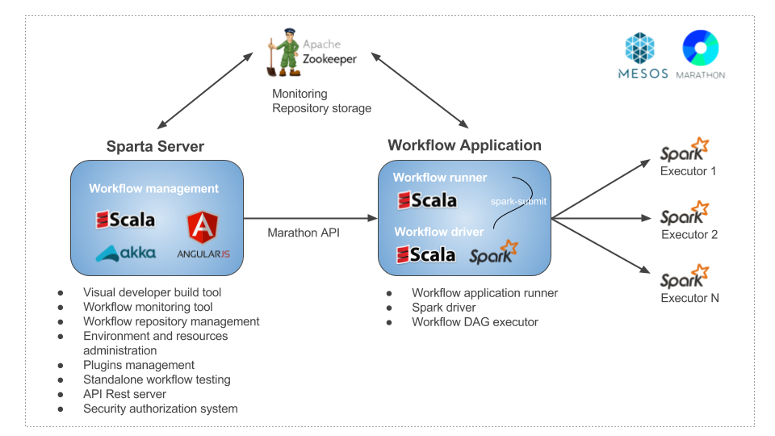
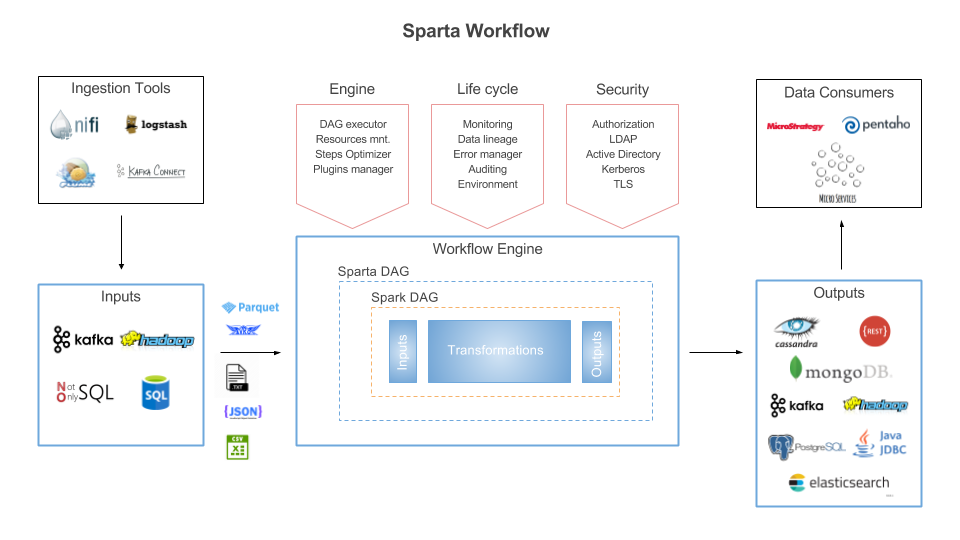

About [Stratio Sparta](http://www.stratio.com/a-data-centric-product/)
============

At Stratio, we have implemented several data analytics and data ingestion projects based on Apache Spark, Kafka or ElasticSearch. These technologies were always a perfect fit, but soon we found ourselves writing the same pieces of integration code over and over again.
Stratio Sparta is the easiest way to make use of the Apache Spark technology and all its ecosystem. Choose your input, transformations and outputs, and start extracting insights out of your data in batch or real-time.

Sparta?
------------

- What is Stratio Sparta?
    
    Stratio Sparta is a powerful tool that allows you to ingest, clean, enrich, filter and analyze data or discover exceptions in batch or real-time, build advanced Big Data applications and monitoring it with an advanced Visual Build Tool.

- Who should use it?

    Sparta is intended for projects who need to process data. These projects might have the need to read the data from different sources such as web sites, sensors, service-health, data storages and many others.

- Why?

    Because nowadays the amount of data that is generated by big companies could be sometimes unmanageable. Sparta helps you to manage this data and to get insights from it in an easy way, reducing the Big Data projects costs based on the best Open Source technologies.

Benefits of using Sparta
------------

 - Develop Big Data applications based on Spark with a Visual Build Tool, you don’t need deep knowledge about Spark.
 - Developers can build custom inputs, transformations and outputs and use it on the user interface. Sparta is build on top of a plugins infrastructure. Everything is pluggable.
 - Use complex and continous aggregations on Spark Streaming.
 - Spark SQL available. Available on Batch and Streaming, also mixing Streaming Data and Batch Data without coding only with SQL language.
 - ETLs and Event processing with Spark.
 - Deploying and monitoring applications or long running processes.
 - High performance and fault tolerance.
 - Fully securized components.
 - Part of the services of Data centric suite.

Main Features
============

Stratio Sparta lets you build workflows that resolves data ingestion, analytical processes, real-time analytics and OLAP on massive volumes of data with high performance. Its high-level features includes:

 - Code-free Big Data applications for all

    Sparta user interface is ready to let you work without writing any line of code. That means that no programming skills are needed to work with Sparta and use advanced technologies such as Spark, Scala, HDFS, or Elasticsearch.
    Developers, BI engenieers, data scientists, business users and IT administrators can create data analytics applications in minutes with a powerful Spark Visual Editor.

 - Multi-Engine designing and deploying Streaming and Batch workflows

    Batch and Streaming Spark API are available with visual components in order to construct real-time data pipelines  or programmed batch processes.

 - Ready-to-use workflow steps (Inputs, Transformations and Outputs)

    There are several inputs, transformations and outputs already implemented that you can use on a drag and drop canvas. The inputs, transformations and outputs already supported are:
    
   - Streaming.
   
        - Inputs: Kafka, HDFS-compatible file systems and SQL over multi-datastores with Spark SQL integration.
        - Transformations: Avro, Casting, Checkpointing, CSV, Cube, DateTime, Distinct, Explode, Filter, Intersection, Json, OrderBy, Persist, Repartition, Select, Split, Trigger, Union, Window
        - Outputs: Elasticsearch, MongoDB, Redis, Parquet, Postgres, JDBC, CSV, Kafka, Avro, HDFS-compatible file systems and others Spark SQL connectors.

   - Batch.
   
        - Inputs: HDFS-compatible file systems and SQL over multi-datastores with Spark SQL integration.
        - Transformations: Avro, Casting, CSV, DateTime, Distinct, Explode, Filter, Intersection, Json, OrderBy, Persist, Repartition, Select, Split, Trigger, Union.
        - Outputs: Elasticsearch, MongoDB, Redis, Parquet, Postgres, JDBC, CSV, Kafka, Avro, HDFS-compatible file systems and others Spark SQL connectors.

 - Extract, Transform and Load (ETL) in minutes

    Stratio Sparta supports data transformations in order to parse and treat the incoming data with structured or unstructured formats: json, csv, avro, txt or tables from SQL or NoSQL databases. The user is also able to execute selecting, filtering or advanced SQL analitycal operations over the transformed data and storage all the workflow steps in one or more outputs.

 - SQL integrated on Streaming and Batch workflows

    Fully-SQL integration in Streaming and Batch workflows. One easy language available on inputs and transformations that allows to create alerts, rules or aggregated data useful to construct advanced real-time dashboards.

 - Easy workflow deployment and monitoring

    Design, configure and deploy multiple workflows with few clicks and monitor it on the Sparta user interface.
Multi-tenant servers and Multi-datacenter deployment are supported over Stratio EOS architecture.

 - Extensible components

    All the workflow steps are customizables. An advanced user can extend the native components and adapt the workflow to the project.

 - End-to-end Big Data applications lifecycle management

    Build, version, test and deploy workflows over any environment easily.

 - Authentication - Authorization - Audit
    
    Fully secured data pipelines end-to-end.
    Integrated with Mesos security; Postgres, Kafka and Elasticsearch security by TLS; Zookeeper and HDFS by Kerberos;
    GoSec integration with ACLs in all the user interface.
    

Architecture
============

Stratio Sparta is based on the creation, execution and monitoring workflows

A workflow is divided in 3 main parts:
    
   - Inputs: where the data is coming from. Currently a  workflow can have one or more inputs surch as continous queries, static queries, kafka brokers or files stored on multiple formats.
   - Transformations: basic or advanced operations over the incoming data surch as json, avro or csv parsers, triggers with full SQL integration, OLAP cubes or advanced filters.
   - Outputs: stores the result of the operations. Each workflow component can have multiple outputs surch as NoSQL databases or Kafka brokers.

Sparta SDK
============

Modular components extensible with simple SDK
You can extend several points of the platform to fulfill your needs, such as adding new inputs, outputs and transformations.

Key technologies
========

- [Spark Streaming & Spark]  (http://spark.apache.org)
- [SparkSQL] (https://spark.apache.org/sql)
- [Akka] (http://akka.io)
- [MongoDB] (http://www.mongodb.org/)
- [Apache Cassandra] (http://cassandra.apache.org)
- [ElasticSearch] (https://www.elastic.co)
- [Redis] (http://redis.io)
- [Apache Parquet] (http://parquet.apache.org/)
- [HDFS] (http://hadoop.apache.org/docs/r1.2.1/hdfs_design.html)
- [Apache Kafka] (http://kafka.apache.org)
- [Apache Flume] (https://flume.apache.org/)
- [RabbitMQ] (https://www.rabbitmq.com/)
- [Spray] (http://spray.io/)
- [Apache Avro] (https://avro.apache.org/)

Build
========

You can generate rpm and deb packages by running:

`mvn clean package -Ppackage`

**Note:** you need to have installed the following programs in order to build these packages:

In a debian distribution:

  - fakeroot
  - dpkg-dev
  - rpm
  - jq
  
In a centOS distribution:

  - fakeroot
  - dpkg-dev
  - rpmdevtools
  - jq
  
In all distributions:

  - Java 8
  - Maven 3

License
========

Licensed to STRATIO (C) under one or more contributor license agreements.
See the NOTICE file distributed with this work for additional information
regarding copyright ownership.  The STRATIO (C) licenses this file
to you under the Apache License, Version 2.0 (the
"License"); you may not use this file except in compliance
with the License.  You may obtain a copy of the License at

  http://www.apache.org/licenses/LICENSE-2.0

Unless required by applicable law or agreed to in writing,
software distributed under the License is distributed on an
"AS IS" BASIS, WITHOUT WARRANTIES OR CONDITIONS OF ANY
KIND, either express or implied.  See the License for the
specific language governing permissions and limitations
under the License.
